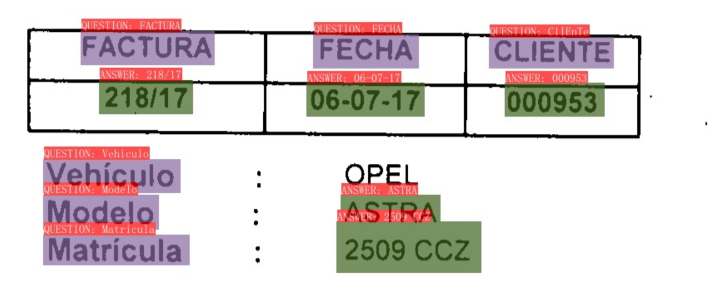
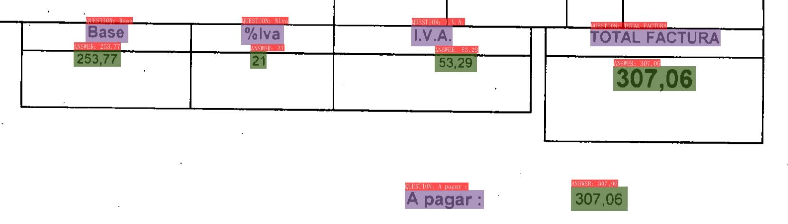

## Otras referencias


data.mendeley.com/datasets samples of electronic invoices --> https://data.mendeley.com/datasets/tnj49gpmtz/2

doctr OCR open source.

https://github.com/katanaml/sparrow


# VI-LayoutXML

Pasos dados para reproducir el proceso de entrenamiento

## Preparación del entorno

 2005  sudo apt install build-essential
 2006  gcc --version
 2007  sudo apt-get install python3-dev
 2015  python3 -m venv .venv
 2016  python3 --version
 2017  sudo apt install python3.10-venv
 2018  python3 -m venv .venv

1999  pip install -r requirements.txt 
2000  pip install -r ppstructure/kie/requirements.txt 
2002  pip install paddleocr -U

2018  pip install paddlepaddle==2.5.1 -i https://mirror.baidu.com/pypi/simple

### Error ImportError: libssl.so.1.1: cannot open shared object file: No such file or directory
Para corregir el error libssl.so.1.1: cannot open shared object file: No such file or directory
https://stackoverflow.com/a/73604364

En la sesión del terminal donde estamos trabajando ejecutamos el siguiente export:

```bash
export LD_LIBRARY_PATH=$HOME/opt/lib:$LD_LIBRARY_PATH
```


Para que el modelo funcione sin gpu en config.yml "Global.use_gpu: false"

## Ejecución de inferencia sobre un ejemplo

```shell
python3 tools/infer_kie_token_ser.py   -c configs/kie/vi_layoutxlm/ser_vi_layoutxlm_xfund_zh.yml   -o Architecture.Backbone.checkpoints=./pretrained_model/ser_vi_layoutxlm_xfund_pretrained/best_accuracy   Global.infer_img=./ppstructure/docs/kie/input/zh_val_42.jpg Global.use_gpu=false

python3 ./tools/infer_kie_token_ser_re.py \
  -c configs/kie/vi_layoutxlm/re_vi_layoutxlm_xfund_zh.yml \
  -o Architecture.Backbone.checkpoints=./pretrained_model/re_vi_layoutxlm_xfund_pretrained/best_accuracy \
  Global.infer_img=./train_data/XFUND/zh_val/val.json \
  Global.use_gpu=False \
  Global.infer_mode=False \
  -c_ser configs/kie/vi_layoutxlm/ser_vi_layoutxlm_xfund_zh.yml \
  -o_ser Architecture.Backbone.checkpoints=./pretrained_model/ser_vi_layoutxlm_xfund_pretrained/best_accuracy 
```
  
## PROCESO DE ENTRENAMIENTO DE XFUND[ES]


Se decargan los ficheros de train y val de español del repo https://github.com/doc-analysis/XFUND/releases/tag/v1.0

Se ubican en la carpeta train_data/XFUND/es_train y es_val del proyecto paddleOCR

Se siguen las instrucciones del siguiente documento: doc/doc_en/kie_en.md

Trasformamos las label de xfund al formato de paddleOCR
python ppstructure/kie/tools/trans_xfun_data.py --ori_gt_path train_data/XFUND/es_train/es.train.json --output_path train_data/XFUND/es_train/train.json

python ppstructure/kie/tools/trans_xfun_data.py --ori_gt_path train_data/XFUND/es_val/es.val.json --output_path train_data/XFUND/es_val/val.json

Dejamos la estructura de directorios según indica el apartado "The final dataset shall have the following file structure." del documento

Realizamos la configuración para el entrenamiento. Los ficheros de configuración los dejamos en config/kie/vi_layoutxml/ser_vi_layoutxml_xfund_es.yml

### Entrenamiento modelo SER

[Documento de referencia: kie_en.md](doc/doc_en/kie_en.md)

```shell
python tools/train.py -c configs/kie/vi_layoutxlm/ser_vi_layoutxlm_xfund_es.yml 
```

> Falla por falta de memoria.

Para solucionar el problema de memoria se ha bajado el _batch size_ de los loader del conjunto de datos de _train_ y _val_ a 1

```yml
...
  loader:
    ...
    batch_size_per_card: 1
    ...

```

Con este cambio se consigue realizar el entrenamiento con los siguientes resultados:

| Parámetro                | Valor                                   |
|--------------------------|-----------------------------------------|
| Cantidad de imágenes de _train_ | 149                              |
| Cantidad de imágenes de _val_   | 50                               |
| Epoch                    | 10                                      |
| Batch size _train_       | 1                                       |
| Batch size _val_         | 1                                       |
| Tiempo de entrenamiento  | ~ 5h. 2023/08/10 [07:56:59 - 12:51:42]  |

| Métrica     | Valor  |
|-------------|--------|
| hmean       | 0.8088 |
| precision   | 0.7902 |
| recall      | 0.8283 |
| fps         | 0.7844 |
| best_epoch  | 10     |

El modelo resultante está en `output/ser_vi_layoutxlm_xfund_es`

### Inferencia modelo SER

> Hay que tener en cuenta que el entrenamiento se hace con datos que no corresponden a facturas de talleres, se ha aprovechado la existencia de un conjunto de datos en español (corresponden a formularios variados), que están ya etiquetados, podríamos suponer que el etiquetado y entrenamiento con datos específicos de facturas de talleres mejoraría los resultados.

Vamos a realizar la prueba de inferencia sobre una factura de talleres, el fichero 

Antes de ejecutar cualquier utilidad de entrenamiento, inferencia, ... hay que volver a incluir en el path de librerías la librería `libssl.so.1.1` con la instrucción 

```shell
export LD_LIBRARY_PATH=$HOME/opt/lib:$LD_LIBRARY_PATH
```

Vamos a realizar el análisis de 5 facturas de pruebas:

```shell
python3 tools/infer_kie_token_ser.py \
  -c configs/kie/vi_layoutxlm/ser_vi_layoutxlm_xfund_es.yml \
  -o Architecture.Backbone.checkpoints=./output/ser_vi_layoutxlm_xfund_es/best_accuracy \
     Global.infer_img=./test_data/invoices \
     Global.use_gpu=false
```

El modelo se ha entrenado con las siguientes etiquetas:
- OTHER
- HEADER
- QUESTION
- ANSWER

El modelo `SER` entrenado a partir de formularios variados (no facturas), etiqueta los elementos que nos importan como _QUESTION_ y _ANSWER_

Posteriormente se debe utilizar el model `RE` que busca la relación entre los elementos _QUESTION_ y _ANSWER_ 
Mostramos el análisis de una de las facturas:


Si revisamos los detalles de una parte de la cabecera de la factura, podemos apreciar en **morado** los elementos que ha detectado como **_QUESTION_** y en **verde** los elementos **_ANSWER_**



En el pie de la página encontramos algo similar:



La aplicación del modelo `RE` buscaría la relación de cada _QUESTION_ con su correspondiente _ANSWER_:

|QUESTION|ANSWER|
|--------|------|
|FACTURA|218/17|
|Matrícula|2509 CCZ|
|....|...|
|Base| 253,77|
|%Iva|21|
|I.V.A|53,29|
|TOTAL FACTURA|307,06|
|A pagar:|307,06|

Posteriormente se podría aplicar un algoritmo que asignara a cada par _QUESTION-ANSWER_ un token específico como *ID_FACTURA*, _MATRICULA_, ...

También se puede realizar la prueba de entrenamiento e inferencia utilizando etiquetas más específicas, del estilo de *ID_FACTURA*, _MATRICULA_,...  De este modo inferencia con el modelo `SER` ya nos daría la información buscada de cada uno de los token.


### Entrenamiento modelo RE

```bash
python3 tools/train.py -c configs/kie/vi_layoutxlm/re_vi_layoutxlm_xfund_es.yml
```

## Pendiente

* [ ] Entrenamiento del modelo `RE` con el dataset `XFUND-ES` y revisión de resultados
* [ ] Etiquetado de conjunto de facturas con labels específicos: nif, matricula, total_factura, ...
* [ ] Entrenamiento del modelo `SER` con el dataset de FTS y revisión de resultados

